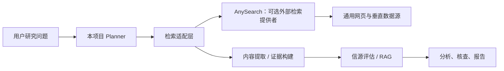
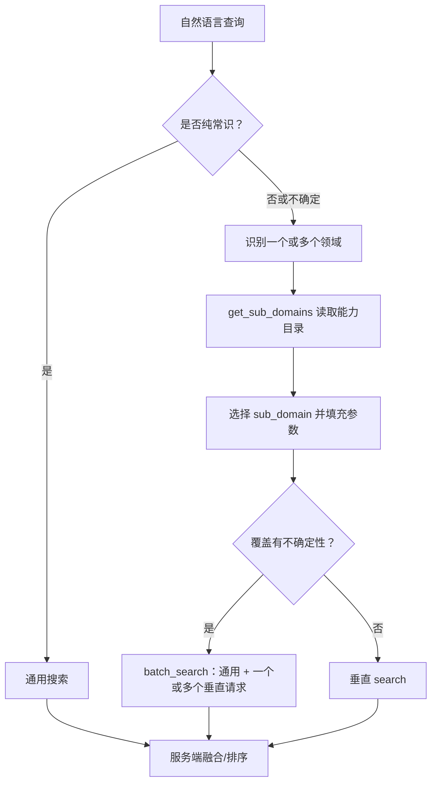

# AnySearch 技术原理与项目借鉴调研

> 调研日期：2026-08-17  
> 目的：厘清 AnySearch 是什么、公开可验证的工作机制是什么，以及它与本项目深度研究系统的边界和可借鉴点。  
> 结论先行：AnySearch 是一个面向 Agent 的**外部检索基础设施层**，不是多 Agent 编排或深度研究框架。它最值得借鉴的是“意图/领域驱动的检索路由、跨来源融合、统一结构化返回和批量接口”；不应把它当作 RAG、证据校验或研究推理的替代品。

## 1. 定位与边界

AnySearch 对外提供一个统一 API，聚合通用网页与金融、学术、法律、健康、代码、安全、专利等垂直领域数据。调用方提交查询及可选的领域参数，服务端完成路由、合并与排序，并向 Agent 返回结构化结果。[官方 FAQ](https://anysearch.com/faq) 明确将其定位为 AI Agent 的搜索基础设施。

它解决的是“**到哪里找、先给哪些资料**”的问题；本项目解决的是“**围绕问题如何规划、如何把资料变为可追溯结论、如何核查与成文**”的问题。两者所在层次不同：



因此，接入 AnySearch 至多替换或补强上图的“检索适配层”；Planner、页面正文处理、向量证据库、引用登记、事实核查和报告写作仍应保留在本项目。

## 2. 公开可验证的系统组成

| 组成 | 职责 | 公开程度 |
|---|---|---|
| 托管搜索服务 | 领域识别、数据源路由、结果合并与 Cross-source fusion ranking | 仅产品描述，核心实现未公开 |
| MCP 端点 | Agent 工具调用协议入口，`https://api.anysearch.com/mcp` | 公开接口规范 |
| REST API | 官方宣称提供 `POST /v1/search`，返回统一 JSON | 功能公开；完整规格未在静态文档中可核验 |
| Skill / CLI | Python、Node、PowerShell、Bash 客户端；将命令转成 MCP JSON-RPC 请求 | Apache-2.0 开源 |
| MCP Server | 为支持 MCP 的宿主提供远程工具接入 | 开源适配层；并非搜索后端 |

需要区分“开源”与“可自建”：`anysearch-skill` 和 `anysearch-mcp-server` 开源的是调用适配器，不是聚合数据源、意图识别模型或融合排序引擎。因此无法仅通过克隆仓库获得等价的私有部署搜索服务。

## 3. 已公开的调用协议

开源 Skill 的接口规范显示：客户端调用 `POST https://api.anysearch.com/mcp`，使用 JSON-RPC 2.0，方法固定为 `tools/call`；可选 `Authorization: Bearer <API_KEY>`。匿名调用可用，但额度与限速更低。[接口规范](https://raw.githubusercontent.com/anysearch-ai/anysearch-skill/main/scripts/shared/doc_spec.md)

概念上的单次检索请求如下：

```json
{
  "jsonrpc": "2.0",
  "id": 1,
  "method": "tools/call",
  "params": {
    "name": "search",
    "arguments": {
      "query": "AAPL 最新财报",
      "domain": "finance",
      "sub_domain": "finance.quote",
      "sub_domain_params": {
        "type": "stock",
        "symbol": "AAPL",
        "cn_code": ""
      },
      "max_results": 5
    }
  }
}
```

客户端会读取 MCP 返回的 `result.content`，直接输出其中的文本块；这解释了 Skill/MCP 面向 Agent 时的 Markdown 输出形态。REST API 则被官方描述为稳定统一的 JSON schema，但应以实际 POC 抓到的响应为准，不能根据 CLI 输出反推 REST 字段。

### 3.1 四个工具能力

| 工具 | 输入与约束 | 作用 |
|---|---|---|
| `search` | `query`；垂直检索时附 `domain`、`sub_domain` 和该子域的参数 | 单条通用或垂直检索 |
| `get_sub_domains` | 一个领域或最多 5 个领域 | 查询可用子域、语义说明、必填参数 |
| `batch_search` | 1–5 条查询，可逐条覆盖领域、子域和参数 | 并行检索多条独立/混合查询，单条失败不阻塞其余结果 |
| `extract` | 一个 HTML URL | 提取正文 Markdown，公开规范标明最多 50,000 字符 |

开源常量列出的领域为：`general`、`resource`、`social_media`、`finance`、`academic`、`legal`、`health`、`business`、`security`、`ip`、`code`、`energy`、`environment`、`agriculture`、`travel`、`film`、`gaming`。[领域常量](https://raw.githubusercontent.com/anysearch-ai/anysearch-skill/main/scripts/shared/constants.json)

## 4. 检索与路由原理

### 4.1 领域目录是一个运行时契约

`domain` 不是简单标签。对垂直检索，Skill 规范要求先调用 `get_sub_domains`，再按返回的子域说明与必填参数发起检索。例如金融报价需要 `finance.quote` 及证券类型、代码等结构化条件；学术论文检索使用 `academic.search`。这让 Agent 不必把每个垂直源的参数规则硬编码进提示词。

这可以看作两级路由：



这里的“纯常识走通用；不确定时混合检索”是其 Skill 的**调用策略**，并不证明服务端只会在单一领域寻找数据。官方 FAQ 则进一步宣称服务端可按查询意图路由多个垂直数据源，再合并排序；二者共同构成“调用方可显式指定，服务端仍可智能路由”的设计。

### 4.2 混合批量检索，而非单一搜索词

`batch_search` 接收 1–5 个查询，每项可拥有独立的 `domain`、`sub_domain`、`sub_domain_params` 与 `max_results`；共同参数只补齐缺失字段，单项配置优先。官方客户端将这批请求作为一次 MCP 工具调用提交，服务端承诺单条失败不阻断其他条目。[Python 客户端实现](https://raw.githubusercontent.com/anysearch-ai/anysearch-skill/main/scripts/anysearch_cli.py)

对于跨领域问题，推荐做法不是把所有意图塞进一个查询，而是为同一研究问题分别生成通用搜索和各领域视角，再合并结果。例如“某新能源公司的技术路线与投资风险”可拆为新闻/行业资料、专利或学术进展、财务行情三路。这与深度研究中的子问题分解相匹配。

### 4.3 服务端融合排序

AnySearch 公开宣称按 **authority（权威性）**、**diversity（多样性）**、**freshness（时效性）** 打分，并使用其 Cross-source fusion ranking 排序；还会识别查询中的时效意图并路由实时数据源。[官方 FAQ](https://anysearch.com/faq)

可合理推断其排序目标不是传统网页搜索的单一相关性，而是为 Agent 给出“覆盖更广、重复更少、更新更及时”的候选集。注意这是根据产品描述作出的架构性推断，以下关键细节均**未公开**：

- 具体接入了哪些数据供应商、哪些领域支持付费数据库；
- 意图分类器、权威性/时效性特征和融合公式；
- 每个领域的召回数、去重规则、重排序模型与离线评测结果；
- 结果中每个字段的来源、生成方式、可复现快照与变更策略。

所以它的排序结果应被视为“候选来源优先级”，不能直接作为事实或引用有效性的证明。

### 4.4 内容提取与 Token 控制

除了搜索摘要，`extract` 返回 HTML 页面的正文 Markdown（上限 50,000 字符）。这减少了 Agent 自己抓取、解析 DOM、清洗样式的工作。官方也宣称面向 MCP/Skill 的输出会压缩为适合 Agent 消费的结构化 Markdown，以减少 Token。

但这有两个工程含义：

1. Markdown 正文仍是外部服务加工的二手表示，关键引文需要保留 URL、抓取时间和原文片段，必要时由本项目复抓验证。
2. “更少 Token”不等于“更少证据”。提取/摘要截断可能隐藏限定条件、表格和反例；应把截断率和证据覆盖度纳入评测。

## 5. 与本项目的对应关系

当前项目已经具备独立的研究流水线：`planner → retriever → content_extractor → source_evaluator → evidence_builder → analyst → fact_checker → report_writer`。检索层由 `SearchService` 统一封装 Tavily 与 DuckDuckGo；支持缓存、Tavily Key 轮换/限速重试、失败降级、`multi_search()` 并发去重，以及通用路 + 静态学术白名单的双路检索。

| AnySearch 能力 | 本项目现状 | 可借鉴的演进 |
|---|---|---|
| 领域/子域目录与参数契约 | 仅用静态 `ACADEMIC_ALLOWLIST` 做学术双路，领域路由未成为结构化决策 | 定义内部 `SearchRoute`：领域、子域、查询改写、允许来源、时效约束、预算与理由 |
| 通用 + 垂直混合检索 | `multi_search()` 已支持多 query 并发；学术双路固定开启 | 由 Planner 产出多个检索意图，按领域选择不同提供者或来源策略，不把“学术”写死为唯一垂直路 |
| 跨源权威/多样性/时效融合 | 下游 `source_evaluator` 评估来源，但搜索结果的跨路合并主要按 URL 去重 | 在 RAG 前增加可解释的融合层：重复聚簇、域名上限、来源类型配额、发布时间与权威性特征 |
| 正文直接返回 | Tavily `raw_content` 已直接进入 `content_extractor`，其余 URL 由 `CrawlerService` 补抓 | 将“正文已取得/待抓取/截断/抓取失败”作为统一状态与质量指标，避免重复抓取 |
| 批处理 | 多 query 用 `asyncio.gather`，可共享并发限制 | 让计划节点明确批组、超时和失败策略；保留每个子问题到结果的映射，不能只做全局 URL 去重 |
| 结构化结果 | `SearchResult` 有标题、URL、摘要、原文、排名、时间、Tavily 分数 | 补充 provider、route、query、来源类型、发布时间、内容截断、融合分和评分原因等可审计元数据 |

本项目现有的“搜索结果有 `raw_content` 时跳过爬虫”已经和 AnySearch 的 `extract` 思路相同。区别在于当前 `SearchResult` 的专属字段名仍是 `tavily_score`、`query_answer`，若引入第二个富结果提供者，应改为中性、可扩展的检索元数据，而不是把 AnySearch 数据塞进 Tavily 字段。

## 6. 推荐的内部抽象（不依赖 AnySearch）

先吸收其方法论，再决定是否采购/接入服务。建议在搜索层定义提供者无关的路由与结果契约：

```python
class SearchRoute:
    query: str
    intent: str                 # e.g. literature, quote, news, regulation
    domain: str                 # e.g. academic, finance, legal
    freshness: str              # historical / current / realtime
    source_policy: str          # general / vertical / hybrid
    allowed_domains: list[str]
    max_results: int
    budget_ms: int
    reason: str

class SearchProvenance:
    provider: str               # tavily / ddg / anysearch / crawler
    route_id: str
    requested_query: str
    source_type: str | None     # paper / news / filing / quote / webpage
    published_at: str | None
    retrieved_at: str
    raw_content_status: str     # present / truncated / pending / failed
    provider_score: float | None
    fusion_score: float | None
```

这能让 Planner 的“研究领域、深度、时效性”真正驱动检索行为，而非仅停留在提示词中；也使结果能被现有引用链和端到端评测体系追踪。领域目录可以先维护在项目配置中，后续再实现为可热更新的注册表；不必依赖外部 `get_sub_domains`。

## 7. 若接入 AnySearch，推荐方式与禁区

### 7.1 推荐为可选 Provider，而不是 MCP 内嵌

在 `app/services/search_service.py` 的 `BaseSearchProvider` 下新增 `AnySearchProvider`，由服务端 HTTP 客户端调用官方 REST API 或 MCP JSON-RPC，并转换为本项目的中性结果模型。通过配置选择或按路由选择提供者，始终保留 Tavily / DuckDuckGo 作为回退。

不建议让 API Worker 再启动/驱动一个面向交互 Agent 的 MCP 客户端或安装 Skill：

- Skill 的目的在于让 Claude/Codex 等宿主快速调用服务，并不是应用内的生产 SDK；
- 直接 HTTP 集成更容易设置超时、重试、限流、观测和密钥隔离；
- 本项目已拥有检索服务抽象，强行绕过它会让缓存、错误降级和来源溯源失效。

### 7.2 保留本项目的证据责任链

接入后，AnySearch 返回的数据只能作为 `SearchResult` 候选。仍必须由本项目：

1. 记录原始查询、领域路由、provider request ID（若响应提供）及抓取时间；
2. 获取/复核可引用正文，维护 URL 到 Citation Registry 的稳定映射；
3. 执行来源质量评估、RAG 证据切片、断言—证据匹配和事实核查；
4. 标注受付费墙、截断、实时价格/行情等不能复现或时效极强的材料。

### 7.3 先做受控 POC，再作替换决策

不要以“搜索结果看起来更多”作为上线依据。使用现有端到端评测方案中的冻结任务集，补充金融、学术、法规、跨领域和强时效任务，对照：

| 维度 | 建议观测指标 |
|---|---|
| 任务完成 | rubric 通过率、遗漏关键维度的比例 |
| 证据与引用 | 有效引用率、断言支持率、权威来源覆盖、重复来源率 |
| 检索过程 | 领域路由正确率、首批可用证据数、正文提取成功率、截断率 |
| 运营 | P50/P95 延迟、每任务外部调用成本、限流/超时率、回退率 |
| 风险 | 查询/结果是否满足数据分级要求、审计信息是否充分、服务不可用时的降级质量 |

用同一 Planner、同一后续 RAG/分析链路比较：基线（Tavily + DDG）、内部路由改进后基线、AnySearch 单独、混合路由。只有在目标任务上同时提升完成度与有效引用，且成本、稳定性与数据合规可接受时，才扩大使用范围。

## 8. 风险、合规与验证清单

官方 FAQ 宣称查询不保存、不用于训练且传输加密；这属于供应商声明，接入企业或敏感研究数据前仍须进行法务、安全与采购审核，不能以宣传页替代数据处理协议或渗透/审计证据。[隐私相关 FAQ](https://anysearch.com/faq)

建议在 POC 前确认：

- 数据处理地域、保留期限、日志字段、子处理方、DPA/删除机制；
- API 版本、配额、计费单位、SLA、速率限制、最大响应/提取长度；
- 对付费、受版权保护、机器人限制页面的可访问范围和再分发条款；
- 搜索结果是否含稳定唯一 ID、请求 ID、发布时间、来源类型和全文/截断标志；
- 断网、429、5xx、空结果与领域参数非法时的错误结构及重试建议；
- 是否允许以本项目的终端用户数据、内部知识或敏感查询发往第三方。

## 9. 可执行结论与优先级

| 优先级 | 建议 | 原因 |
|---|---|---|
| P0 | 在内部实现“检索路由 + 结果来源元数据 + 可解释融合” | 解决当前静态学术双路的扩展性问题，不受供应商约束，并提升评测可观测性 |
| P1 | 为 AnySearch 设计可选 Provider 的小型适配 POC | 验证垂直数据覆盖和融合质量是否确有端到端收益 |
| P2 | 将通过验证的领域纳入按需混合路由 | 让学术、金融、法规等各自按任务使用，不做全局替换 |
| 不建议 | 以 AnySearch 替换 RAG、信源评估、引用核验、事实核查或研究编排 | 检索排序不能证明结论正确，更不能建立可追溯证据链 |

## 10. 参考资料

- [AnySearch FAQ](https://anysearch.com/faq)：产品定位、服务端路由/融合/时效性与安全声明。
- [AnySearch 开发者入口](https://www.anysearch.com/docs)：官方 API、MCP、Skill 文档入口。
- [anysearch-skill README](https://github.com/anysearch-ai/anysearch-skill)：支持的功能、安装方式与客户端发布情况。
- [AnySearch Interface Specification](https://raw.githubusercontent.com/anysearch-ai/anysearch-skill/main/scripts/shared/doc_spec.md)：MCP 协议、四类工具、参数及推荐调用流程。
- [Python CLI](https://raw.githubusercontent.com/anysearch-ai/anysearch-skill/main/scripts/anysearch_cli.py)：JSON-RPC 请求封装、鉴权、批量参数注入和客户端约束。
- [领域常量](https://raw.githubusercontent.com/anysearch-ai/anysearch-skill/main/scripts/shared/constants.json)：公开列出的领域范围。
- [anysearch-mcp-server](https://github.com/anysearch-ai/anysearch-mcp-server)：MCP 适配器的开源仓库。
